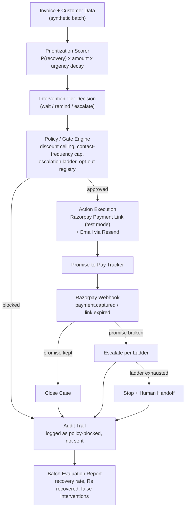

# Recoup — Autonomous B2B Receivables & Promise-to-Pay Agent

**An AI agent that decides who to chase for overdue B2B invoices, how hard, and when to stop — then proves exactly how much money it recovered.**

Built for the **Razorpay AI Buildathon 2026 — Track 03: AI Revenue Recovery**.

> *Note: rename the project if you land on something you like better — "Recoup" is a working title chosen to be short, on-theme, and free of collision with the buildathon's own product names.*

[]()
[]()
[]()
[]()
[]()

---

## Table of Contents

- [The Problem](#the-problem)
- [What This Agent Actually Does](#what-this-agent-actually-does)
- [Why This Is Not Another Reminder Bot](#why-this-is-not-another-reminder-bot)
- [How It's Different From Razorpay's Own Agent Studio](#how-its-different-from-razorpays-own-agent-studio)
- [Architecture](#architecture)
- [The Agentic Loop, Walked Through](#the-agentic-loop-walked-through)
- [Safety: Bounded, Gated, Explainable](#safety-bounded-gated-explainable)
- [What Success Looks Like](#what-success-looks-like)
- [Tech Stack](#tech-stack)
- [Project Structure](#project-structure)
- [Getting Started](#getting-started)
- [Environment Variables](#environment-variables)
- [API Surface](#api-surface)
- [The Synthetic Dataset](#the-synthetic-dataset)
- [Running the Batch Demo](#running-the-batch-demo)
- [Build Status](#build-status)
- [What's Deliberately Out of Scope for the Buildathon](#whats-deliberately-out-of-scope-for-the-buildathon)
- [Roadmap to Production](#roadmap-to-production)
- [License](#license)

---

## The Problem

India's Economic Survey (Budget 2026) put **₹8.1 lakh crore** currently stuck in delayed payments owed to MSMEs nationally. A 2026 industry report from Recordent found the *average* Indian SME is carrying **₹3.83 crore** in overdue receivables at any given time. This isn't an edge case — it's one of the most common working-capital problems a B2B or SaaS business in India will face.

Today, someone in finance — often the founder, in a small company — works through a spreadsheet deciding who to email, how firmly to word it, and when to give up. It's manual, generically worded, and inconsistent: the customer who reliably pays a week late gets the same templated email as the customer who's gone genuinely quiet, and nobody is tracking whether "I'll pay Friday" actually happened.

Recoup takes that judgment call off a person's plate — without taking away their control over it.

## What This Agent Actually Does

Given a book of overdue B2B invoices, Recoup:

1. **Ranks them** by expected recovery value, not just amount or days overdue.
2. **Decides an intervention tier** for each — leave alone, remind gently, or escalate — based on a policy the business owner controls.
3. **Acts for real**, generating a Razorpay test-mode Payment Link and sending it through a real channel.
4. **Tracks promises.** When a customer says "I'll pay Friday," that commitment is recorded and watched.
5. **Verifies outcomes**, not assumptions — a Razorpay webhook, not a guess, confirms whether the invoice was actually paid.
6. **Escalates or stops** on a compliant, pre-agreed cadence — it never nags indefinitely, and it respects an opt-out instantly.
7. **Logs every decision** with its reasoning, so nothing it does is a black box.
8. **Reports the batch result** — invoices processed, ₹ recovered, recovery rate, false interventions, compliance violations — because one cherry-picked success story proves nothing.

## Why This Is Not Another Reminder Bot

| A generic dunning script | Recoup |
|---|---|
| Same email to every overdue customer | Ranks by expected recovery value; low-risk invoices are deliberately left alone |
| Reminds until someone tells it to stop | Hard escalation ladder with an automatic stop — no indefinite nagging |
| Any discount an LLM feels like offering | A policy-enforced discount ceiling the LLM cannot exceed, checked before anything is sent |
| "Reminder sent" is the whole log | Every action carries a reason; the full decision trail is queryable |
| Success = "we sent emails" | Success = a batch-level ₹ recovered number, measured, not claimed |
| No memory of what was promised | Promises are recorded, watched against their deadline, and drive the next action automatically |

## How It's Different From Razorpay's Own Agent Studio

Razorpay already ships production agents for revenue recovery — most relevantly, **Subscription Recovery**, which retries and nudges customers on *failed recurring consumer billing*. Recoup was scoped deliberately to sit in the gap next to it, not to reproduce it:

| | Subscription Recovery (Razorpay, shipped) | Recoup |
|---|---|---|
| Domain | Consumer subscriptions, recurring billing | B2B invoices, net-30/60 trade credit |
| Core mechanism | Retry logic + reminder nudges | Prioritize → diagnose → policy-bounded negotiate → track promise → verify → escalate/stop |
| Decision basis | Payment failure reason | Expected-value ranking across an entire receivables book |
| What's remembered | Payment success/fail | Explicit promise-to-pay commitments and whether they were honored |
| Evidence produced | — | Batch-level recovery rate, ₹ recovered, false-intervention rate, compliance adherence |

This is a conscious choice: a submission that looks like a smaller copy of a product Razorpay already sells doesn't demonstrate anything new. A submission that fills a real, adjacent gap does.

## Architecture



**Service responsibilities:**

| Component | Responsibility |
|---|---|
| Scorer | Ranks every open invoice by expected recovery value |
| Policy engine | The single gate every outbound action must pass — hard caps, no exceptions |
| Action executor | Creates a real Razorpay test-mode Payment Link, sends the reminder/offer |
| Promise tracker | Records commitments, checks them against their deadline |
| Webhook receiver | The only source of truth for "was this actually paid" |
| Escalation state machine | Moves a case through wait → remind → escalate → stop |
| Audit log | Immutable record of every decision and its reason |
| Evaluation reporter | Turns a full batch run into the recovery-rate table judges will look at |
| LLM client (provider-agnostic) | Drafts explanation/reminder text only — never decides amounts or bypasses the policy engine |

## The Agentic Loop, Walked Through

```
INV-1042   Rs 50,000    5 days overdue   Customer: reliably pays late, but pays
INV-1043   Rs 2,00,000  12 days overdue  Customer: high-value, new risk signals
INV-1044   Rs 75,000    2 days overdue   Customer: strong payment history
```

- **INV-1044** scores below the intervention threshold → left alone. Contacting a customer who's about to pay anyway is a false intervention, and the batch report tracks those as a cost, not a win.
- **INV-1042** scores as low-urgency → a single friendly reminder, no discount offered.
- **INV-1043** scores as high expected-value-at-risk → escalated to the account's finance contact, with a bounded offer ("pay ₹1,80,000 by Friday, ₹20,000 late fee waived") — where ₹20,000 is a ceiling *the business owner configured*, not a number the LLM invented.

The customer replies "I'll pay Friday." That's logged as a promise: customer, amount, date. Friday arrives with no payment → the case escalates per the pre-agreed ladder, not a retry loop that runs forever.

## Safety: Bounded, Gated, Explainable

This is the part that separates an agent Razorpay would trust with their brand from a script that sends emails:

- **Discount ceiling** — the agent can offer at most a business-owner-set % or ₹ waiver. It cannot invent a bigger concession to close faster, and the policy engine — not the LLM — enforces this.
- **Contact-frequency cap** — no more than one outbound touch per invoice within a configured window.
- **Escalation ladder, not nagging** — a fixed sequence (e.g. friendly reminder → second reminder → escalate to account manager → automated contact stops, human takes over) that terminates.
- **Instant opt-out** — a customer who says "stop contacting me, I'll handle this directly" is never auto-contacted again.
- **Full explainability** — every action logs *why*: `"escalated: promise-to-pay date 2026-09-05 passed with no payment; invoice > policy threshold Rs 1,00,000"`.
- **Verification over assumption** — "paid" is only ever set from a Razorpay webhook event, never inferred from a promise alone.

## What Success Looks Like

Run against a full batch, not a cherry-picked example. These are the actual
numbers from `docs/evaluation_report.md`, regenerable with the command below:

```
Invoices processed:                      600
Total overdue value:                     Rs 6.96 Cr
Decision cycles run:                     5
Cases flagged for intervention:          513
Cases left alone:                        87
Cases handed off to a human:             402
Interventions executed (all cycles):     505
Actions blocked by policy (all cycles):  626
Recovered (of flagged):                  326
Recovered value:                         Rs 3.97 Cr
Recovery rate (of flagged):              63.5%
False/unnecessary interventions:         263
Cases correctly left alone:              81
Missed recoveries (left alone, unpaid):  6
Compliance violations:                   0
Decision trace entries:                  5452
Ledger hash chain verified:              yes
```

```bash
python scripts/run_batch_demo.py --batch-size 600 --seed 42 --cycles 5
```

### Training the recovery model

The model artifact is not committed (trained binaries never are). Train it in
about a minute on a laptop CPU, then re-run the demo against it:

```bash
python scripts/train_recovery_model.py --batch-size 6000 --seed 42
```

```bash
python scripts/run_batch_demo.py --batch-size 600 --seed 42 --cycles 5 --use-model
```

The training script trains a logistic baseline, gradient-boosted trees and a
small neural net on the same temporal split, calibrates each on validation, and
prints all three against the rules-based scorer they are meant to replace.
[`docs/recovery_model_card.md`](docs/recovery_model_card.md) records the
results, including the ones that did not go the way a bigger model would want.

**Read these honestly — [`docs/evaluation_report.md`](docs/evaluation_report.md)
explains each caveat in full:**

- The scorer above is the rules-based one (the default). Add `--use-model` to
  score with the trained, calibrated model instead — see
  [`docs/recovery_model_card.md`](docs/recovery_model_card.md).
- The synthetic generator samples outcomes *independently of what the agent
  does*, so the recovery rate measures **targeting** — did the agent act on the
  invoices that were going to be paid — not causation. No uplift number is
  claimed, because measuring one needs a holdout arm this simulation lacks.
- 263 false interventions is a real cost, reported rather than hidden.
- Zero compliance violations is counted from the decision trace, not asserted.

## Tech Stack

| Layer | Choice | Why |
|---|---|---|
| API | Python 3.11+, FastAPI, Pydantic v2 | Typed contracts, fast to iterate, async-friendly |
| Database | PostgreSQL (Neon or Supabase free tier) | Relational integrity for invoices, promises, audit log |
| Payments | Razorpay Payment Links + Webhooks (test mode) | Real, verifiable payment lifecycle with zero financial risk |
| Email delivery | Resend (free tier) | Fast to stand up, no business-verification wait unlike WhatsApp Business API |
| LLM (explanation/reminder text only) | Provider-agnostic client; Groq or Gemini free tier for the demo, swappable to Claude | Zero-cost demo, and a genuine architecture point — the reasoning layer never decides amounts |
| Hosting | Render free web service | Simplest path to a public demo URL |
| Testing | Pytest | Core scorer/policy logic must be unit-tested, not just demoed |

## Project Structure

```text
.
├── app/
│   ├── main.py                      # FastAPI app entrypoint
│   ├── api/
│   │   ├── health.py                # liveness + DB check
│   │   ├── invoices.py              # ingest, read, audit trail, run-cycle
│   │   ├── webhooks.py              # Razorpay webhook receiver
│   │   ├── reports.py               # batch evaluation report (dry run)
│   │   └── policy.py                # the active policy, as served data
│   ├── core/
│   │   ├── domain.py                # CaseSnapshot: what a decision reads
│   │   ├── scorer.py                # expected-value prioritization
│   │   ├── policy.py                # the gate (business-rules)
│   │   ├── escalation.py            # escalation state machine (transitions)
│   │   ├── promise_tracker.py       # promise-to-pay logic
│   │   ├── audit.py                 # hash-chained Decision Trace
│   │   ├── agent.py                 # the decision cycle, end to end
│   │   ├── evaluation.py            # batch report
│   │   ├── config.py                # settings
│   │   └── logging.py               # structlog setup
│   ├── models/                      # SQLAlchemy tables + shared enums
│   ├── schemas/                     # API request/response contracts
│   ├── db/session.py                # async engine + session
│   └── services/
│       ├── llm_client.py            # provider-agnostic; instructor for schemas
│       ├── razorpay_client.py       # Payment Links + webhook verification
│       ├── resend_client.py         # email delivery
│       └── repository.py            # all database access
├── src/
│   ├── data/synthetic_generator.py  # seeded synthetic batch
│   └── ml/                          # prediction schemas, reply understanding
├── alembic/                         # migrations (0001_baseline)
├── scripts/
│   ├── run_batch_demo.py            # full agent loop + evaluation report
│   └── generate_synthetic_data.py   # dataset export
├── tests/                           # 384 tests, no DB or network required
├── docs/
│   ├── architecture.md              # expanded architecture + roadmap
│   └── evaluation_report.md         # generated output of the last batch run
├── .env.example
├── pyproject.toml
├── requirements.txt
└── README.md
```

*(This reflects what is actually in the repository, not an intended layout.)*

## Getting Started

### Prerequisites

- Python 3.11+
- A Razorpay account with **test-mode** API keys (no KYC needed for test mode)
- Free accounts: [Neon](https://neon.com) or [Supabase](https://supabase.com) (Postgres), [Resend](https://resend.com) (email), [Groq](https://groq.com) or [Google AI Studio](https://aistudio.google.com) (LLM)

### Setup

```bash
git clone https://github.com/<your-username>/recoup.git
cd recoup

python -m venv .venv
source .venv/bin/activate        # Windows: .venv\Scripts\activate
pip install -r requirements.txt

cp .env.example .env             # fill in the values below
```

### Run

```bash
uvicorn src.main:app --reload
```

- API docs: `http://localhost:8000/docs`
- Health check: `http://localhost:8000/api/v1/health`

## Environment Variables

| Variable | Purpose |
|---|---|
| `DATABASE_URL` | Postgres connection string (Neon/Supabase) |
| `RAZORPAY_KEY_ID` | Razorpay test-mode key ID |
| `RAZORPAY_KEY_SECRET` | Razorpay test-mode key secret |
| `RAZORPAY_WEBHOOK_SECRET` | Used to verify incoming webhook signatures |
| `RESEND_API_KEY` | Email delivery |
| `LLM_PROVIDER` | `groq` \| `gemini` \| `anthropic` — selects the client implementation |
| `GROQ_API_KEY` / `GEMINI_API_KEY` / `ANTHROPIC_API_KEY` | Set only the one matching `LLM_PROVIDER` |
| `MAX_DISCOUNT_PERCENT` | Hard ceiling the policy engine enforces on any offer |
| `MAX_CONTACT_FREQUENCY_DAYS` | Minimum gap between outbound touches per invoice |
| `ESCALATION_LADDER_DAYS` | Comma-separated day offsets for each escalation step, e.g. `1,3,7,14` |
| `APP_ENV` | `development` \| `demo` \| `production` |

Never commit a filled-in `.env`. `.env.example` should contain keys only, no real values.

## API Surface

| Method | Path | Purpose |
|---|---|---|
| `GET` | `/api/v1/health` | Liveness check |
| `POST` | `/api/v1/invoices/batch` | Ingest a batch of invoices/customers (e.g. the synthetic dataset) |
| `GET` | `/api/v1/invoices/{id}` | View one invoice's current state |
| `GET` | `/api/v1/invoices/{id}/audit` | Full decision trail for one invoice |
| `POST` | `/api/v1/invoices/{id}/run-cycle` | Manually trigger one agent decision cycle (useful for the demo) |
| `POST` | `/api/v1/webhooks/razorpay` | Razorpay Payment Link webhook receiver |
| `GET` | `/api/v1/reports/batch` | The evaluation report shown above |
| `GET` | `/api/v1/policy` | View the currently configured policy (ceilings, caps, ladder) |

*(All of the above are implemented and routed. `GET /api/v1/health/db` also exists.)*

## The Synthetic Dataset

Real B2B receivables data isn't available for a public demo, so `src/data/synthetic_generator.py` produces a batch of invoices and customers with a deliberately *believable* payment-behavior distribution, not a uniform-random one:

- Customers have varied historical payment behavior (reliably-on-time, reliably-late-but-pays, genuinely-erratic, new/unknown), and invoice outcomes are generated consistent with that behavior — not independently random per invoice.
- Invoice amounts and overdue durations follow a realistic long-tail distribution rather than a flat range.
- A minority of customers exhibit a believable risk-escalation pattern (previously reliable, now slipping) so the "new risk signal" case in the walkthrough above is representable in the data, not hand-picked.

Document the generator's assumptions in `docs/architecture.md` — being upfront about how the data was built is part of the "honest metrics" standard this track is judged on.

## Running the Batch Demo

```bash
python scripts/run_batch_demo.py --batch-size 600
```

This runs the full agent loop against a freshly generated batch and prints the evaluation report in the format shown in [What Success Looks Like](#what-success-looks-like). Commit the actual output to `docs/evaluation_report.md` before submission — that file, not this README, is the evidence judges will check most closely.

## Build Status

Use this table as a running checklist while building — update it honestly as pieces land; an inflated status table is worse than an honest, partially-checked one.

| Piece | Status |
|---|---|
| Synthetic dataset generator | ☑ Done — `src/data/synthetic_generator.py`, seeded and tested |
| ML prediction schemas & contracts | ☑ Done — `src/ml/schemas/` |
| Reply understanding (LLM baseline) | ☑ Done — `instructor`-backed, degrades to `OTHER` |
| Prioritization scorer | ☑ Done — rules-based; declares `fallback_used=True` |
| Recovery-probability model | ☑ Done — `xgb-recovery`, calibrated; AUC 0.779 vs 0.732 rules ([model card](docs/recovery_model_card.md)) |
| Policy / gate engine | ☑ Done — `business-rules`; rules compiled from config |
| Escalation state machine | ☑ Done — `transitions`; `auto_transitions=False` |
| Audit trail (Decision Trace) | ☑ Done — append-only, hash-chained, tamper-tested |
| Promise-to-pay tracker | ☑ Done — `app/core/promise_tracker.py` |
| Database models + migrations | ☑ Done — 7 tables, Alembic baseline |
| API surface | ☑ Done — all 7 documented routes live |
| Razorpay Payment Links integration | ☑ Client done — not yet called from the agent loop |
| Razorpay webhook verification | ☑ Done — signature-checked and idempotent |
| Email delivery (Resend) | ☑ Client done — not yet called from the agent loop |
| Batch evaluation report | ☑ Done — `docs/evaluation_report.md`, regenerable |
| One handled failure case | ☑ Done — malformed LLM output → `OTHER` + human queue |
| Unit tests for scorer/policy | ☑ Done — 384 tests |
| Architecture doc | ☑ Done — `docs/architecture.md` |
| Pitch video | ☐ Not started |

**Known gaps, stated plainly:**

- The action executor is not wired. The agent decides, gates and records
  correctly, and the Razorpay/Resend clients work, but nothing calls them from
  `run_cycle` yet — no real payment link is created and no email is sent.
- The recovery model is trained but **off by default**. Set `USE_MODEL_SCORER=true`
  (or pass `--use-model` to the batch demo) to score with it; the rules stay the
  default so a fresh clone with no trained artifact behaves predictably. Either
  way the model is trained on **synthetic** data — the metrics show the pipeline
  recovers a signal that was deliberately planted, not real-world accuracy.
- Reply understanding is not connected to the decision cycle. It classifies
  correctly in isolation; `run_cycle` does not yet consume its output.

## What's Deliberately Out of Scope for the Buildathon

Cut on purpose, not from lack of ideas — each of these is called out explicitly rather than silently missing, and each has a home in the roadmap below:

- WhatsApp delivery (Meta Business verification can't clear in the buildathon window; Resend email stands in for the demo)
- LLM-drafted negotiation offers (offers start as policy-checked templates; free-text negotiation is a stretch goal, never a bypass of the policy engine)
- Multi-tenant auth — this is a single-tenant demo
- Any production infrastructure (Kubernetes, Terraform, observability stack, SLOs)

## Roadmap to Production

This MVP is **production-shaped, not production-hardened** — typed models, a real payment integration, tested core logic — and here's what hardening it further would mean:

- Multi-tenant auth (OIDC/JWT) and per-business row-level data isolation
- WhatsApp Business API delivery once verification clears
- Multi-horizon (7/14/30/60-day) survival-style recovery prediction, and online retraining from real webhook-confirmed payments
- Idempotency and retry-safety hardening on the webhook handler — payments infrastructure cannot afford to double-count a confirmation
- Secrets management, observability, and backup/restore procedures once this handles real customer communication
- A real legal/compliance review of the escalation cadence against actual debt-collection practice guidance before any real customer is contacted

## License

MIT — or whichever license you prefer; update this section and add a `LICENSE` file before making the repo public.
