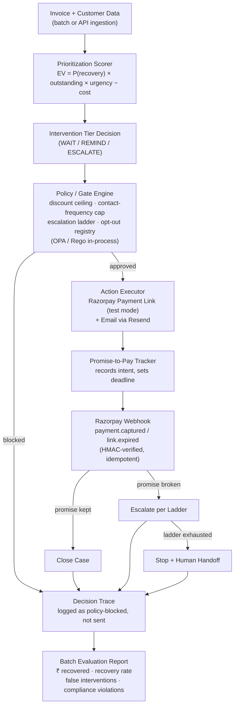

<div align="center">

<h1>Recoup</h1>
<h3>Autonomous B2B Receivables &amp; Promise-to-Pay Agent</h3>

<p><em>An AI agent that decides who to chase for overdue B2B invoices, how hard, and when to stop — then proves exactly how much money it recovered.</em></p>

<br/>

[](https://razorpay.com)
[](https://python.org)
[](https://fastapi.tiangolo.com)
[](https://postgresql.org)
[](LICENSE)

<br/>

---

### 📄 Documentation

| Document | Description |
|---|---|
| **[📘 Full Technical Documentation (PDF)](./Recoup_Technical_Documentation.pdf)** | Complete backend readbook — architecture, all components, API surface, ML models, security model, scaling, deployment |
| **[📝 Full Technical Documentation (Word)](./Recoup_Technical_Documentation.docx)** | Same content in editable Word format |
| **[🏗️ Architecture Deep-Dive](./docs/architecture.md)** | Expanded component responsibilities, design decisions, safety properties |
| **[📊 Batch Evaluation Report](./docs/evaluation_report.md)** | Live metrics from a 600-invoice run — recovery rate, ₹ recovered, compliance violations |
| **[🤖 Recovery Model Card](./docs/recovery_model_card.md)** | AUC, Brier, ECE, SHAP importance for the XGBoost recovery scorer |
| **[💬 Reply Classifier Model Card](./docs/reply_classifier_model_card.md)** | TF-IDF/SVM cascade — F1, precision, recall, human-review rate |
| **[💰 Cash Forecast Model Card](./docs/cash_forecast_model_card.md)** | Monte Carlo coverage and bias metrics |
| **[⏰ Contact Timing Model Card](./docs/contact_timing_model_card.md)** | Thompson Sampling bandit performance |
| **[📉 Drift Model Card](./docs/drift_model_card.md)** | Payment behaviour drift classifier |
| **[🚀 Deployment Guide](./docs/DEPLOYMENT.md)** | Render + Vercel + Neon deployment walkthrough |
| **[🔒 Operations & Infrastructure Design](./Wave3-Operations-Infrastructure-Design.md)** | OTel tracing, secrets management, backup drills, SLOs |
| **[⚖️ Legal / Compliance Review](./docs/legal/dunning_review.md)** | Escalation cadence vs. Indian debt-collection practice guidance |
| **[📋 Operations Runbook](./docs/runbook.md)** | On-call procedures, incident response, secret rotation |
| **[🔍 SLO Reference](./docs/slo.md)** | All service-level objectives and alerting thresholds |

---

</div>

## Table of Contents

- [The Problem](#the-problem)
- [What This Agent Actually Does](#what-this-agent-actually-does)
- [Why This Is Not Another Reminder Bot](#why-this-is-not-another-reminder-bot)
- [High-Level Architecture](#high-level-architecture)
- [The Five-Step Decision Pipeline](#the-five-step-decision-pipeline)
- [The Agentic Loop, Walked Through](#the-agentic-loop-walked-through)
- [Safety: Bounded, Gated, Explainable](#safety-bounded-gated-explainable)
- [Machine Learning Models](#machine-learning-models)
- [Tech Stack](#tech-stack)
- [Project Structure](#project-structure)
- [Getting Started](#getting-started)
- [Environment Variables](#environment-variables)
- [API Surface](#api-surface)
- [Batch Evaluation Results](#batch-evaluation-results)
- [Security Model](#security-model)
- [Observability](#observability)
- [Deployment](#deployment)
- [Roadmap to Production](#roadmap-to-production)
- [Known Gaps & Honest Caveats](#known-gaps--honest-caveats)
- [License](#license)

---

## The Problem

India's Economic Survey (Budget 2026) put **₹8.1 lakh crore** currently stuck in delayed payments owed to MSMEs nationally. A 2026 industry report from Recordent found the *average* Indian SME is carrying **₹3.83 crore** in overdue receivables at any given time. This isn't an edge case — it's one of the most pervasive working-capital problems a B2B or SaaS business in India will face.

Today, someone in finance — often the founder in a small company — works through a spreadsheet deciding who to email, how firmly to word it, and when to give up. It's manual, generically worded, and inconsistent:

- The customer who reliably pays a week late gets the same templated email as the customer who's gone genuinely quiet.
- Nobody is systematically tracking whether "I'll pay Friday" actually happened.
- Discount concessions are ad-hoc, not policy-bounded.
- There's no batch-level evidence of whether the process is working.

**Recoup takes that judgment call off a person's plate — without taking away their control over it.**

---

## What This Agent Actually Does

Given a book of overdue B2B invoices, Recoup:

1. **Ranks them** by expected recovery value — `P(recovery) × outstanding × urgency_weight − intervention_cost` — not just by amount or days overdue.
2. **Decides an intervention tier** for each — WAIT, REMIND, or ESCALATE — based on a policy the business owner controls.
3. **Acts for real**, generating a Razorpay test-mode Payment Link and sending it via email (Resend) with a signed Reply-To address for reply tracking.
4. **Tracks promises.** When a customer says "I'll pay Friday," that commitment is recorded, watched against its deadline, and drives the next action automatically.
5. **Verifies outcomes** from a Razorpay webhook — a signature-checked, idempotent event — not from a promise or assumption.
6. **Escalates or stops** on a compliant, pre-agreed ladder that terminates. It never nags indefinitely, and it respects an opt-out instantly and permanently.
7. **Logs every decision** with its reasoning in a hash-chained, tamper-evident audit trail.
8. **Reports the batch result** — invoices processed, ₹ recovered, recovery rate, false interventions, compliance violations — because one cherry-picked success story proves nothing.

---

## Why This Is Not Another Reminder Bot

| A generic dunning script | Recoup |
|---|---|
| Same email to every overdue customer | Ranks by expected recovery value; low-risk invoices are deliberately left alone |
| Reminds until someone tells it to stop | Hard escalation ladder with an automatic stop — no indefinite nagging |
| Any discount an LLM feels like offering | A policy-enforced discount ceiling the LLM cannot exceed, checked before anything is sent |
| "Reminder sent" is the whole log | Every action carries a reason; the full decision trail is queryable per invoice |
| Success = "we sent emails" | Success = a batch-level ₹ recovered number, measured not claimed |
| No memory of what was promised | Promises are recorded, watched against their deadline, and drive the next action |
| LLM decides strategy | LLM drafts copy only — the gate decides everything else |

---

## High-Level Architecture



### Service Responsibilities

| Component | Module | Responsibility |
|---|---|---|
| Prioritization Scorer | `app/core/scorer.py` | Ranks every open invoice by expected recovery value |
| Policy / Gate Engine | `app/core/policy.py` | Single gate every outbound action must pass — hard caps, no exceptions |
| Escalation State Machine | `app/core/escalation.py` | Moves a case through monitoring → reminded → escalated → human_handoff |
| Promise Tracker | `app/core/promise_tracker.py` | Records commitments, checks them against their deadline |
| Action Executor | `app/services/` | Creates Razorpay Payment Link, dispatches email, logs the action |
| Webhook Receiver | `app/api/webhooks.py` | Only source of truth for "was this actually paid" |
| Decision Trace | `app/core/audit.py` | Immutable, hash-chained record of every decision and its reason |
| Event Store | `app/core/eventsourcing/` | Dual-writes every decision as domain events; time-travel replay |
| Evaluation Reporter | `app/core/evaluation.py` | Turns a full batch run into the recovery-rate table |
| LLM Client | `app/services/llm_client.py` | Drafts explanation/reminder text **only** — never decides amounts or bypasses the gate |
| Reply Classifier | `src/ml/reply/` | Two-stage cascade: TF-IDF/SVM → LLM; uncertain replies go to human review |
| Recovery Scorer (ML) | `src/ml/recovery/` | XGBoost + Logistic Regression + MLP, calibrated; optional replacement for rules-based scorer |
| Cash Forecaster | `src/ml/cash_forecast/` | Monte Carlo P10/P50/P90 cash-in forecast over the at-risk book |
| Contact Timing | `src/ml/contact_timing/` | Segmented Thompson Sampling bandit for optimal contact slot |
| Drift Detector | `src/ml/drift/` | Flags customers whose payment behaviour is shifting from their archetype |

---

## The Five-Step Decision Pipeline

Every action the agent takes passes through exactly five ordered steps. The order is the safety property, not a style choice:

```
score  →  propose  →  GATE  →  transition  →  execute
```

| Step | Module | Decides |
|---|---|---|
| **score** | `app/core/scorer.py` | What is this invoice worth acting on? |
| **propose** | `app/core/agent.py` | What is the next rung, and how hard do we push? |
| **gate** | `app/core/policy.py` | Is that permitted by policy? (OPA/Rego in-process) |
| **transition** | `app/core/escalation.py` | May this case move to the next state? |
| **execute** | `app/services/` | Send it, and log that we did |

> **Key invariant:** execution receives a `PolicyDecision`, never a raw `ProposedAction`. There is no code path that sends a message without a gate verdict attached. Both approved **and** blocked actions are recorded by `app/core/audit.py` — a blocked action leaves as much evidence as a sent one.

---

## The Agentic Loop, Walked Through

```
INV-1042   ₹ 50,000    5 days overdue   Customer: reliably pays late, but pays
INV-1043   ₹2,00,000  12 days overdue   Customer: high-value, new risk signals
INV-1044   ₹ 75,000    2 days overdue   Customer: strong payment history
```

**Step 1 — Score:**
- INV-1044: P(recovery)=0.84 → positive EV → **REMIND**
- INV-1042: low urgency, reliable payer → **REMIND** (single friendly, no discount)
- INV-1043: high EV at risk, deteriorating signals → **ESCALATE**

**Step 2 — Propose:**
INV-1043 → LLM drafts: *"Pay ₹1,80,000 by Friday; ₹20,000 late fee waived."* The ₹20,000 is the configured ceiling. The LLM did not pick this number — the policy engine did.

**Step 3 — Gate:**
All three pass contact-frequency cap (not contacted in last 3 days) and the opt-out registry. INV-1043 discount: 10% ≤ 10% ceiling → **APPROVED**.

**Step 4 — Transition:**
Each invoice advances one rung on the escalation state machine.

**Step 5 — Execute:**
Razorpay Payment Links generated (test mode). Resend emails dispatched. Signed Reply-To addresses encode the invoice IDs for automatic reply routing. All three actions appended to the Decision Trace with their reasons.

**Promise Tracking:**
Customer on INV-1043 replies: *"I'll pay Friday."* → Classified as `PROMISE_TO_PAY` by the cascade classifier → recorded as a promise. Friday arrives, no `payment.captured` webhook → promise broken → escalates exactly one rung, per the pre-agreed ladder.

---

## Safety: Bounded, Gated, Explainable

| Safeguard | How it's enforced |
|---|---|
| **Discount ceiling** | `MAX_DISCOUNT_PERCENT` — the gate re-evaluates the offer amount independently of the LLM's text |
| **Contact-frequency cap** | `MAX_CONTACT_FREQUENCY_DAYS` — minimum gap per invoice, checked by the gate and the FSM guard |
| **Escalation ladder** | `pytransitions` with `auto_transitions=False` — the four declared triggers are the only way a case can move |
| **Instant opt-out** | `OPT_OUT` reply → permanently blocks all future automated contacts for that invoice |
| **Full explainability** | Every action logged with reason: `"escalated: promise-to-pay 2026-09-05 passed with no payment; invoice > Rs 1,00,000"` |
| **Verification over assumption** | `PAID` is only ever set from a signature-verified Razorpay `payment.captured` webhook |
| **Tamper-evident audit trail** | Hash-chained ledger — editing any entry breaks every subsequent hash |
| **Compliance violations counted from the ledger** | The detector reads the Decision Trace, not the orchestrator's return values — a bug in the orchestrator cannot suppress the count |

---

## Machine Learning Models

Recoup ships **five ML models**, all trained on synthetic data for the demo. Each has a model card in [`docs/`](./docs/).

### Recovery Probability Scorer [`docs/recovery_model_card.md`](./docs/recovery_model_card.md)

Three candidates trained on a temporal split and isotonically calibrated:

| Model | AUC | Brier | ECE | Top-120 ₹ at risk |
|---|---|---|---|---|
| Rules-based (incumbent) | 0.667 | 0.2433 | 0.180 | ₹79.5L |
| `logreg-recovery` (calibrated) | **0.709** | **0.1944** | **0.065** | **₹85.5L (+7.5%)** |

Top SHAP features: `recency_weighted_on_time_score`, `customer_on_time_ratio_all_time`, `prior_promise_kept`, `customer_avg_days_late`.

### Reply Intent Classifier [`docs/reply_classifier_model_card.md`](./docs/reply_classifier_model_card.md)

Two-stage cascade (TF-IDF/SVM → LLM via `instructor`):
- **Stage A** handles 35.6% of replies at **0.917 accuracy**
- **Grouped macro-F1: 0.764**
- Ambiguous replies → `GET /api/v1/replies/review` (human queue, never guessed)

Labels: `PROMISE_TO_PAY`, `DISPUTE`, `OPT_OUT`, `ACKNOWLEDGEMENT`, `OTHER`

### Cash Forecast Model [`docs/cash_forecast_model_card.md`](./docs/cash_forecast_model_card.md)

Monte Carlo simulation over the at-risk book — P10/P50/P90 cash-in forecasts over 7-day and 30-day horizons. Served at `GET /api/v1/forecast/cash`.

### Contact Timing Bandit [`docs/contact_timing_model_card.md`](./docs/contact_timing_model_card.md)

Segmented Thompson Sampling — learns which day-of-week / time-of-day contact slots yield the highest promise-to-pay conversion per customer archetype.

### Drift Detector [`docs/drift_model_card.md`](./docs/drift_model_card.md)

Flags customers whose payment behaviour is shifting from their historical archetype (rolling payment ratio, days-late trend, dispute velocity). Drifting customers receive a higher urgency weight in the scorer.

---

## Tech Stack

| Layer | Choice | Why |
|---|---|---|
| API | Python 3.11+, FastAPI, Pydantic v2, Uvicorn | Typed contracts, async-native, fast iteration |
| Database | PostgreSQL (Neon/Supabase) via SQLAlchemy 2.0 async + psycopg3 | Relational integrity; async; Alembic migrations |
| Local dev DB | SQLite via aiosqlite | Zero-infrastructure demo and CI |
| Payments | Razorpay Payment Links + Webhooks (test mode) | Real verifiable payment lifecycle; zero financial risk |
| Email delivery | Resend | Fast setup; signed Reply-To for automatic reply routing |
| LLM (copy only) | Groq / Gemini / Anthropic — provider-agnostic | Zero-cost demo; reasoning layer never decides amounts |
| Policy engine | `business-rules` + `regopy` (in-process OPA/Rego) | Rules as data; Rego evaluated at <20ms p99; no sidecar |
| Escalation FSM | `pytransitions` (`auto_transitions=False`) | Ladder enforced structurally — no code can skip rungs |
| Structured LLM | `instructor` | Schema-bound output with validation-aware retry |
| Event sourcing | `eventsourcing` | Aggregate stream; time-travel replay; audit parity |
| ML — training | XGBoost, scikit-learn, SHAP, joblib | Recovery scorer; calibrated; explainable via SHAP |
| Rate limiting | Redis (hiredis) sliding window | Shared state across replicas; in-process deque fallback |
| Observability | OpenTelemetry SDK + OTLP | Traces + metrics; console fallback locally |
| Logging | structlog + python-json-logger | Structured JSON; request-ID correlation |
| Frontend | Next.js (Vercel) | Invoice dashboard, audit viewer, policy inspector |
| Email worker | Cloudflare Email Worker | Routes inbound email replies to `POST /api/v1/replies` |
| Hosting | Render (backend) + Vercel (frontend) | Single public URL; no infrastructure overhead |
| Testing | Pytest (384 tests) | No DB or network required; all core logic unit-tested |

---

## Project Structure

```text
.
├── app/
│   ├── main.py                      FastAPI entry point, lifespan, middleware wiring
│   ├── api/
│   │   ├── health.py                Liveness + DB check
│   │   ├── invoices.py              Ingest, read, audit trail, run-cycle
│   │   ├── webhooks.py              Razorpay webhook receiver (HMAC-verified, idempotent)
│   │   ├── replies.py               Inbound email reply handling + human review queue
│   │   ├── reports.py               Batch evaluation report
│   │   ├── policy.py                Active policy served as data
│   │   ├── tasks.py                 Background batch task management (kill switch)
│   │   ├── cash_forecast.py         Probabilistic cash-in forecasting
│   │   ├── contact_timing.py        Contact timing recommendations
│   │   ├── drift.py                 Payment behaviour drift detection
│   │   ├── broken_promise.py        Broken promise detection and escalation
│   │   ├── secrets.py               Secret management operations
│   │   ├── integrations.py          External service credential management
│   │   ├── models.py                ML model metadata and retraining triggers
│   │   └── payments.py              Payment confirmation
│   ├── core/
│   │   ├── domain.py                CaseSnapshot — the read model for decisions
│   │   ├── scorer.py                Expected-value prioritisation scorer
│   │   ├── policy.py                Gate (business-rules + OPA/Rego via regopy)
│   │   ├── escalation.py            FSM: monitoring → reminded → escalated → human_handoff
│   │   ├── promise_tracker.py       Promise-to-pay logic and deadline enforcement
│   │   ├── audit.py                 Append-only, hash-chained Decision Trace
│   │   ├── agent.py                 Decision cycle — the agentic loop, end to end
│   │   ├── evaluation.py            Batch evaluation report computation
│   │   ├── config.py                Pydantic Settings (single source of truth)
│   │   ├── logging.py               structlog setup
│   │   ├── observability.py         OTel setup, request-ID middleware
│   │   └── eventsourcing/           Event store — dual-write, time-travel replay
│   ├── models/                      SQLAlchemy ORM tables + shared enums
│   ├── schemas/                     Pydantic request/response contracts
│   ├── db/session.py                Async engine + session factory
│   └── services/
│       ├── llm_client.py            Provider-agnostic LLM wrapper (Groq/Gemini/Anthropic)
│       ├── razorpay_client.py       Payment Links + webhook signature verification
│       ├── resend_client.py         Email delivery with signed Reply-To
│       ├── repository.py            All database access (single module, no leakage)
│       └── batch_runner.py          Batch cycle orchestration (advisory-locked)
├── src/
│   ├── data/synthetic_generator.py  Seeded synthetic invoice + customer batch
│   └── ml/
│       ├── recovery/                Recovery probability model (train + serve)
│       ├── reply/                   Reply intent cascade classifier
│       ├── cash_forecast/           Monte Carlo cash-in forecast simulation
│       ├── contact_timing/          Thompson Sampling contact timing bandit
│       └── drift/                   Payment behaviour drift classifier
├── alembic/                         Database migrations (Alembic, 11 versions)
├── scripts/
│   ├── run_batch_demo.py            Full agent loop + evaluation report
│   ├── train_recovery_model.py      Trains XGBoost/logreg/MLP recovery scorer
│   ├── seed_demo.py                 Loads synthetic data into the database
│   ├── generate_pdf.py              Generates Recoup_Technical_Documentation.pdf
│   └── generate_docx_final.py       Generates Recoup_Technical_Documentation.docx
├── tests/                           384 tests — no DB or network required
├── frontend/                        Next.js dashboard (Vercel)
├── cloudflare-email-worker/         Routes inbound email to POST /api/v1/replies
├── docs/                            Architecture, model cards, evaluation report
├── Recoup_Technical_Documentation.pdf   ← Complete backend readbook (PDF)
├── Recoup_Technical_Documentation.docx  ← Same in editable Word format
├── pyproject.toml                   Single dependency source of truth
├── alembic.ini
├── Dockerfile
├── render.yaml
└── README.md
```

---

## Getting Started

### Prerequisites

- Python 3.11+
- A Razorpay account with **test-mode** API keys (no KYC needed for test mode)
- Free accounts: [Neon](https://neon.tech) or [Supabase](https://supabase.com) (Postgres), [Resend](https://resend.com) (email), [Groq](https://groq.com) or [Google AI Studio](https://aistudio.google.com) (LLM)

### Setup

```bash
git clone https://github.com/Harish-0412/Recoup-Autonomous-B2B-Receivables-Promise-to-Pay-Agent.git
cd Recoup-Autonomous-B2B-Receivables-Promise-to-Pay-Agent

python3.11 -m venv .venv
source .venv/bin/activate        # Windows: .venv\Scripts\activate

pip install -e ".[dev]"          # includes ML extras and test tools
cp .env.example .env             # fill in the values listed below
```

> `pip install -e "."` installs the API only. `[ml]` adds the ML stack (~500 MB); `[dev]` includes it plus test tools. `[doc]` adds `python-docx` for documentation generation.

### Create the Schema

Alembic owns the schema — the app never creates tables at startup:

```bash
alembic upgrade head
```

### Load Demo Data

```bash
python scripts/seed_demo.py --batch-size 120 --seed 42
```

### Run

```bash
uvicorn app.main:app --reload
```

- Health check: `http://localhost:8000/api/v1/health`
- API docs (DEBUG=true only): `http://localhost:8000/docs`

### Run the Batch Demo (no database or network required)

```bash
python scripts/run_batch_demo.py --batch-size 600 --seed 42 --cycles 5
```

### Train the Recovery Model

```bash
python scripts/train_recovery_model.py --batch-size 6000 --seed 42
python scripts/run_batch_demo.py --batch-size 600 --seed 42 --cycles 5 --use-model
```

### Regenerate the Documentation

```bash
pip install -e ".[doc]"
python scripts/generate_pdf.py    # → Recoup_Technical_Documentation.pdf
python scripts/generate_docx_final.py  # → Recoup_Technical_Documentation.docx
```

---

## Environment Variables

| Variable | Purpose |
|---|---|
| `DATABASE_URL` | Postgres connection string (auto-normalised to `postgresql+psycopg://`) |
| `RAZORPAY_KEY_ID` | Razorpay test-mode key ID |
| `RAZORPAY_KEY_SECRET` | Razorpay test-mode key secret |
| `RAZORPAY_WEBHOOK_SECRET` | HMAC-SHA256 secret for webhook signature verification |
| `RESEND_API_KEY` | Email delivery |
| `LLM_PROVIDER` | `groq` \| `gemini` \| `anthropic` |
| `GROQ_API_KEY` / `GEMINI_API_KEY` / `ANTHROPIC_API_KEY` | Set only the one matching `LLM_PROVIDER` |
| `MAX_DISCOUNT_PERCENT` | Hard ceiling the gate enforces on any offer (e.g. `10`) |
| `MAX_CONTACT_FREQUENCY_DAYS` | Minimum gap between outbound touches per invoice (e.g. `3`) |
| `ESCALATION_LADDER_DAYS` | Comma-separated day offsets for each rung, e.g. `1,3,7,14` |
| `DRY_RUN` | `true` (default) = log actions without sending; `false` = live |
| `USE_MODEL_SCORER` | `true` = XGBoost scorer; `false` (default) = rules-based |
| `APP_ENV` | `development` \| `demo` \| `production` |
| `DEBUG` | `true` = `/docs` enabled; `false` (default) = disabled |
| `RATE_LIMIT_REDIS_URL` | Redis URL for distributed rate limiting (in-process deque fallback) |
| `OTEL_EXPORTER_OTLP_ENDPOINT` | OTLP export target (console JSON fallback if absent) |

> Never commit a filled-in `.env`. `.env.example` contains keys only — no real values.

---

## API Surface

All routes are under `/api/v1/`. Interactive docs available at `/docs` only when `DEBUG=true`.

| Method | Path | Purpose |
|---|---|---|
| `GET` | `/api/v1/health` | Liveness check |
| `GET` | `/api/v1/health/db` | Database connectivity check |
| `POST` | `/api/v1/invoices/batch` | Ingest a batch of invoices and customers |
| `GET` | `/api/v1/invoices/{id}` | View one invoice's current state |
| `GET` | `/api/v1/invoices/{id}/audit` | Full hash-chained decision trail for one invoice |
| `POST` | `/api/v1/invoices/{id}/run-cycle` | Manually trigger one agent decision cycle |
| `POST` | `/api/v1/webhooks/razorpay` | Razorpay Payment Link webhook receiver (HMAC-verified, idempotent) |
| `POST` | `/api/v1/replies` | Inbound email reply from Resend webhook |
| `GET` | `/api/v1/replies/review` | Human review queue for ambiguous replies |
| `GET` | `/api/v1/reports/batch` | Batch evaluation report |
| `GET` | `/api/v1/forecast/cash` | Probabilistic 7/30-day cash-in forecast |
| `GET` | `/api/v1/forecast/cash/card` | Validation metrics for the cash forecast |
| `GET` | `/api/v1/policy` | Currently configured policy (ceilings, caps, ladder) |
| `POST` | `/api/v1/tasks/run-batch` | Trigger autonomous batch run (advisory-locked, kill switch) |
| `GET` | `/api/v1/secrets/status` | Secret provider health and last-refresh time |
| `POST` | `/api/v1/secrets/refresh` | Manually trigger secret refresh (zero-downtime rotation) |

---

## Batch Evaluation Results

Run against 600 invoices, 5 decision cycles, seed 42, trained ML scorer. Fully reproducible:

```bash
python scripts/run_batch_demo.py --batch-size 600 --seed 42 --cycles 5 --use-model
```

```
Invoices processed:                      600
Total overdue value:                     ₹6.96 Cr
Decision cycles run:                     5
Cases flagged for intervention:          574
Cases left alone:                        26
Cases handed off to a human:             468
Interventions executed (all cycles):     580
Actions blocked by policy (all cycles):  699
Recovered (of flagged):                  385
Recovered value:                         ₹4.68 Cr
Recovery rate (of flagged):              67.1%
False/unnecessary interventions:         316
Cases correctly left alone:              22
Missed recoveries (left alone, unpaid):  4
Compliance violations:                   0
Decision trace entries:                  5,807
Ledger hash chain verified:              yes
```

**Policy blocks by rule:**
- `contact_volume_cap`: 511 blocks
- `contact_frequency_cap`: 208 blocks

Full report with ML evaluation panel, calibration curves, and SHAP analysis: [`docs/evaluation_report.md`](./docs/evaluation_report.md)

---

## Security Model

```
External Requests
    │
    ▼
CORS Middleware (explicit origin list, never wildcard)
    │
    ▼
Request ID Middleware (UUID correlation, propagated through all spans)
    │
    ▼
HMAC-SHA256 Webhook Verification (before any payload parsing)
    │
    ▼
Policy Gate — OPA/Rego in-process (discount ceiling · opt-out registry · contact cap)
    │
    ▼
Business Logic
    │
    ├── Opt-out Registry (permanent block, no bypass)
    ├── Audit Trail (hash-chained, tamper-evident)
    └── Rate Limiter (Redis sliding window across replicas)
```

- **Discount ceiling**: the LLM cannot offer more than `MAX_DISCOUNT_PERCENT` regardless of what text it generates. The gate re-evaluates the amount independently.
- **Opt-out**: once set, blocks all automated contacts permanently. There is no code path that bypasses this.
- **Secrets**: values are scrubbed before any structlog emission. Never appear in logs or traces.
- **Webhook security**: HMAC-SHA256 verified against `RAZORPAY_WEBHOOK_SECRET` before any payload parsing. Invalid signature returns 400 immediately.
- **Audit integrity**: hash-chained ledger — any edit, reorder, or deletion breaks every subsequent hash. Verified in tests and in the evaluation report.

See [`Wave3-Operations-Infrastructure-Design.md`](./Wave3-Operations-Infrastructure-Design.md) for the full security and observability design.

---

## Observability

### OpenTelemetry Tracing

Auto-instrumented: FastAPI (request spans), SQLAlchemy (query spans), httpx (outbound HTTP).

Manual span hierarchy:
```
batch.cycle
  ├── batch.scoring_phase
  │     └── invoice.score  (per invoice)
  ├── batch.decision_phase
  │     └── invoice.decision
  └── batch.execution_phase
        └── invoice.execute
```

Exports to OTLP endpoint when `OTEL_EXPORTER_OTLP_ENDPOINT` is set; falls back to stdout JSON (no account needed locally).

### SLOs

| Metric | Target |
|---|---|
| Batch cycle p95 latency | < 30 seconds |
| Health check response | < 500 ms |
| Policy gate decision | < 20 ms p99 (in-process Rego) |
| Webhook verify + ack | < 200 ms |
| Secret refresh | < 100 ms |

Full SLO reference: [`docs/slo.md`](./docs/slo.md) · Operations runbook: [`docs/runbook.md`](./docs/runbook.md)

---

## Deployment

### Infrastructure

| Component | Hosting |
|---|---|
| Backend API | Render free web service (Python, uvicorn) |
| Frontend dashboard | Vercel (Next.js) |
| Database | Neon or Supabase free tier (PostgreSQL) |
| Email inbound worker | Cloudflare Email Worker |
| Redis (optional) | Render Redis or Upstash |

### Release Process

```bash
alembic upgrade head   # ← run before every deploy (schema first, then code)
uvicorn app.main:app   # ← application starts; SELECT 1 confirms DB reachable
```

Full deployment walkthrough: [`docs/DEPLOYMENT.md`](./docs/DEPLOYMENT.md)

---

## Roadmap to Production

The MVP is **production-shaped, not production-hardened** — typed models, a real payment integration, tested core logic. Hardening it means:

| Item | Status |
|---|---|
| Multi-tenant auth (OIDC/JWT + RLS) | Not started |
| WhatsApp Business API delivery | Blocked on Meta verification; email stands in |
| Webhook idempotency hardening | Production-grade double-counting protection needed |
| Online model retraining from webhooks | Not started |
| Policy Simulation Engine (counterfactual replay) | Contract defined (`POST /policy/simulate`); engine not built |
| SetFit reply classifier (few-shot) | Needs labelled replies |
| Observability stack (Grafana/Tempo) | Local console fallback currently |
| Backup drills + rotation runbooks | Designed; not yet automated |
| Legal/compliance review of escalation cadence | Not started — required before any live customer contact |
| Kubernetes / Terraform | Out of scope for MVP |

---

## Known Gaps & Honest Caveats

**`DRY_RUN` defaults to `true`.** Out of the box, every message is fully rendered and logged rather than delivered. Set `DRY_RUN=false` with real Razorpay test-mode and Resend keys to actually send. Contacts are recorded as `SIMULATED`, which still consumes the contact caps.

**The recovery model is trained on synthetic data.** The metrics in [`docs/evaluation_report.md`](./docs/evaluation_report.md) show the pipeline recovers a signal that was deliberately planted — not real-world accuracy.

**The evaluation measures targeting, not causation.** The synthetic generator samples invoice outcomes independently of what the agent does. The recovery rate answers "did the agent act on the invoices that were going to be paid?" — not "did the agent cause them to be paid?" Measuring uplift requires a holdout arm this simulation does not have, so no uplift number is claimed.

**263–316 false interventions is a real cost.** Reported rather than hidden. Contacting a customer who was about to pay anyway is a cost — and the batch report counts it.

**Zero compliance violations is counted from the ledger.** The detector reads the Decision Trace, not the orchestrator's return values, so a bug in the orchestrator cannot suppress the number that would reveal it.

---

## Build Status

| Piece | Status |
|---|---|
| Synthetic dataset generator | ✅ Done — `src/data/synthetic_generator.py` |
| ML prediction schemas & contracts | ✅ Done — `src/ml/schemas/` |
| Reply understanding (LLM baseline) | ✅ Done — `instructor`-backed, degrades to `OTHER` |
| Reply intent classifier (TF-IDF/SVM cascade) | ✅ Done — grouped macro-F1 0.764, cascade 0.917 at 35.6% |
| Action executor | ✅ Done — Resend + Razorpay links; `DRY_RUN` default |
| Prioritization scorer (rules-based) | ✅ Done — declares `fallback_used=True` |
| Recovery probability model (ML) | ✅ Done — XGBoost/logreg/MLP; AUC 0.709 vs 0.667 rules |
| Cash forecast model | ✅ Done — Monte Carlo P10/P50/P90 |
| Contact timing bandit | ✅ Done — segmented Thompson Sampling |
| Drift detector | ✅ Done — joblib artifact |
| Reply ingestion (Promise-to-Pay) | ✅ Done — `POST /api/v1/replies`, signed Reply-To routing |
| Autonomous batch runs | ✅ Done — `POST /api/v1/tasks/run-batch`, advisory-locked, kill switch |
| Policy / gate engine | ✅ Done — OPA/Rego in-process (`regopy`) |
| Escalation state machine | ✅ Done — `pytransitions`; `auto_transitions=False` |
| Audit trail (Decision Trace) | ✅ Done — append-only, hash-chained |
| Event sourcing (dual-write) | ✅ Done — `eventsourcing`; time-travel replay |
| Promise-to-pay tracker | ✅ Done — `app/core/promise_tracker.py` |
| Database models + migrations | ✅ Done — 7 tables, 11 Alembic versions |
| API surface (all routes) | ✅ Done |
| Razorpay Payment Links integration | ✅ Done — test mode |
| Razorpay webhook verification | ✅ Done — HMAC-verified, idempotent |
| Email delivery (Resend) | ✅ Done |
| Batch evaluation report | ✅ Done — `docs/evaluation_report.md`, regenerable |
| Technical documentation (PDF + DOCX) | ✅ Done — `Recoup_Technical_Documentation.pdf` / `.docx` |
| Unit tests (scorer/policy/audit/ML) | ✅ Done — 384 tests, no DB or network required |
| Frontend dashboard | ✅ Done — Next.js on Vercel |

---

## License

MIT — see [`LICENSE`](LICENSE) for details.

---

<div align="center">
<sub>Built for the Razorpay AI Buildathon 2026 — Track 03: AI Revenue Recovery</sub>
</div>
